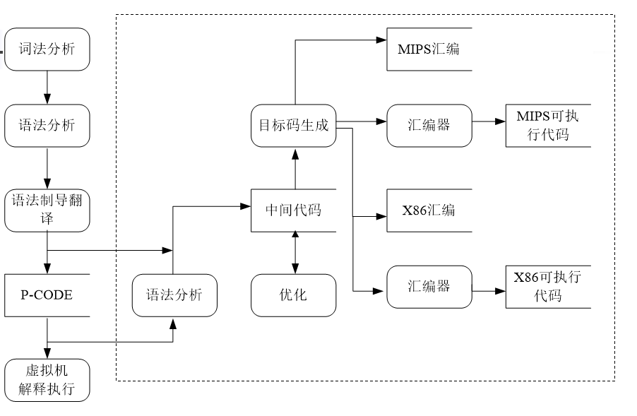
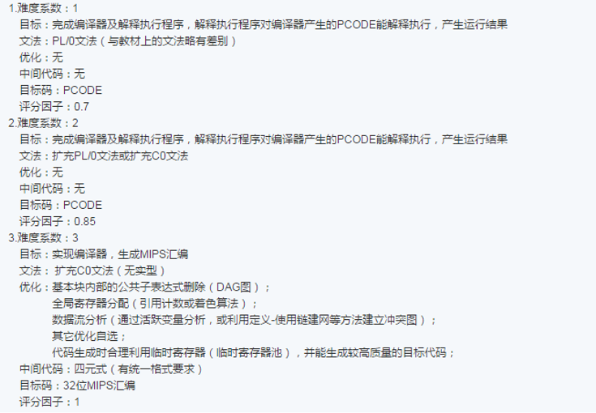
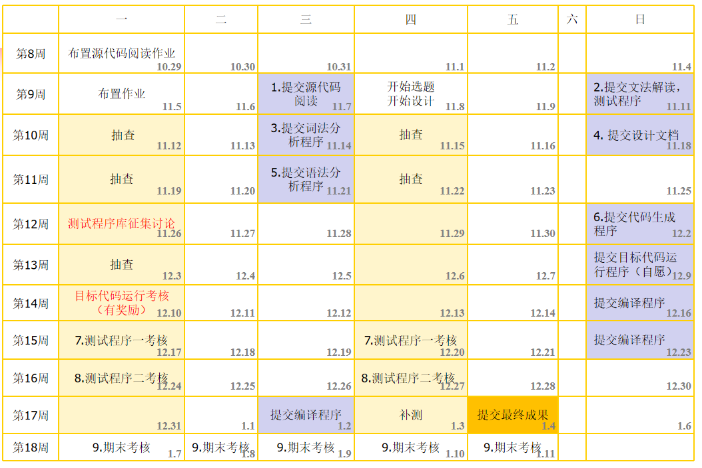
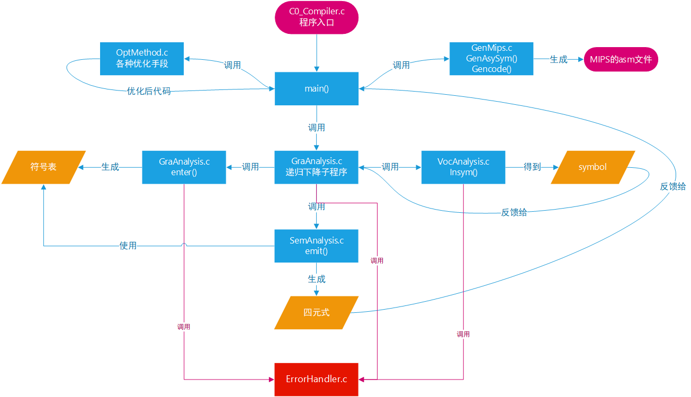

# C0-compiler-design (2018 fall in SCSE, BUAA)

## Basic Introduction
The repostory includes a complete design of *C0-compiler*, fully coded in **C language** and referring to the most classical compiler architecture. Besides the modern basic architecture, the author employed several **optimized methods** to obtain more efficient ultimate *MIPS* code. 

More than the code version, the repostory also contains a final concluding article about my design and plenty of typical testing code which is coded in **C0 language**, contributed by my classmates and of course, myself. 

This code is also author's final semester assignment in ***Course: C0-compiler-design*** in *SCSE BUAA*, 2018 Fall, directed by *Prof.Zhang Li*, thankfully and respectively.

## Basic Compiling Process

As we all know, a classical compiler mainly includes these important parts: *Lexical Analysis*, *Grammar Analysis*, *Semantic Analysis & Intermediate Code Generation*, *Code Generation*, *Optimization* and *Operations of Symbol Table*. **A basic process example** is shown as follows:



## Mission Setting
Some mission settings have to be mentioned in this section, which mainly are outlines of the course.
- Difficulty Division
We have 3 different difficulty division in our course, which have been given as follows. We choose the **Level III**.



- Mission Schedule

Our **Developing schedule** is shown as follows!



- [**C0-Grammar**: A Special Teaching Grammar](requirement/C0-grammar.doc)

  C0-Grammar is a **C-likely** language grammar, and it mainly abstract the essence part, for instance, ***recurrence***, ***loop***, etc. 
  
```
＜加法运算符＞	::= +｜-
＜乘法运算符＞ 	::= *｜/
＜关系运算符＞ 	::=  <｜<=｜>｜>=｜!=｜==
＜字母＞ 		::= ＿｜a｜．．．｜z｜A｜．．．｜Z
＜数字＞ 		::= 0｜＜非零数字＞
＜非零数字＞ 	::= 1｜．．．｜9
＜专用符号＞ 	::= （｜）｜｛｜｝｜,｜;｜＝
＜字符＞  		::=	 ‘<加法运算符＞｜＜乘法运算符＞｜＜字母＞｜＜数字＞’
＜字符串＞ 		::=	 "｛十进制编码为32,33,35-126的ASCII字符｝" 
＜程序＞ 			::= ［＜常量说明部分＞］［＜变量说明部分＞］{＜有返回值函数定义部分＞}{＜无返回值函数定义部分＞}＜主函数＞
＜常量说明部分＞	::= 	const＜常量定义＞;{ const＜常量定义＞;}
＜常量定义＞ 		::= 	int＜标识符＞＝＜整数＞{,＜标识符＞＝＜整数＞}
|float＜标识符＞＝＜实数＞{,＜标识符＞＝＜实数＞}
| char＜标识符＞＝＜字符＞{,＜标识符＞＝＜字符＞}
＜整数＞ 			::= ［＋｜－］＜非零数字＞｛＜数字＞｝｜０
＜实数＞ 			::= ［＋｜－］<整数>[.<整数>]
＜标识符＞ 			::=  ＜字母＞｛＜字母＞｜＜数字＞｝
＜声明头部＞ 		::= 	int＜标识符＞ |float ＜标识符＞|char＜标识符＞
＜变量说明部分＞ 	::=	<变量定义>;{<变量定义>;}
＜变量定义＞		::= ＜类型标识符＞＜标识符＞{,＜标识符＞}
＜类型标识符＞      ::=  int | float | char
＜有返回值函数定义部分＞ 	::= 	＜声明头部＞‘(’ ＜参数＞ ‘)’  ‘{’ ＜复合语句＞ ‘}’
＜无返回值函数定义部分＞ 	::=	void<标识符>‘(’ <参数> ‘)’  ‘{’  <复合语句> ‘}’
＜复合语句＞ 		::= 	［＜常量说明部分＞］［＜变量说明部分＞］＜语句列＞
＜参数＞ 			::=	＜参数表＞
＜参数表＞ 			::=  ＜类型标识符＞＜标识符＞{,＜类型标识符＞＜标识符＞}| 空
＜主函数＞ 			::=	void main ‘(’ ＜参数＞ ‘)’  ‘{’ ＜复合语句＞ ‘}’
＜表达式＞ 			::= ［＋｜－］＜项＞{＜加法运算符＞＜项＞}
＜项＞ 				::= ＜因子＞{＜乘法运算符＞＜因子＞}
＜因子＞ 			::= ＜标识符＞｜‘(’＜表达式＞‘)’｜＜整数＞｜＜有返回值函数调用语句＞|<实数>|＜字符＞
＜语句＞ 			::= ＜条件语句＞｜＜循环语句＞｜‘{’<语句列>‘}’｜＜返回语句＞;|＜有返回值函数调用语句＞; |＜无返回值函数调用语句＞；
｜＜赋值语句＞;｜＜读语句＞;｜＜写语句＞;｜＜空＞
＜赋值语句＞ 		::= 	＜标识符＞＝＜表达式＞
＜条件语句＞		::= 	if ‘(’＜条件＞‘)’＜语句＞［else＜语句＞］
＜条件＞ 			::=  ＜表达式＞＜关系运算符＞＜表达式＞｜＜表达式＞ //表达式为0条件为假，否则为真
＜循环语句＞ 		::= 	while ‘(’＜条件＞‘)’＜语句＞| for‘(’ ＜标识符＞＝＜表达式＞；<条件>；＜标识符＞＝＜表达式＞‘)’<语句>  
＜有返回值函数调用语句＞ ::= ＜标识符＞‘(’＜值参数表＞‘)’
＜无返回值函数调用语句＞ ::= ＜标识符＞‘(’＜值参数表＞‘)’
＜值参数表＞ 		::= ＜表达式＞{,＜表达式＞}｜＜空＞
＜语句列＞			::= ＜语句＞｛＜语句＞｝
＜读语句＞ 			::= 	scanf ‘(’＜标识符＞‘)’
＜写语句＞ 			::=	printf ‘(’[<字符串>,][＜表达式 ＞] ‘)’
＜返回语句＞ 		::= 	return[‘(’＜表达式＞‘)’]
```

## Calling Relationship in author's design

If need, you could constract this with the classical process mentioned before.

## About the optimization methods
The mainly optimization methods the coder employ include *Constant Combination*, *DAG graph calculation*, *counting to decide global register*, *peep optimization*. In fact compiling optimization is really a challenging mission, even harder than the whole architecture. And ***optimization never ends***.

## Concluding Article
Please click [here](files/introduction_to_my_compiler.doc) to download the concluding document of the whole compiler design which is in `.doc` format. It includes the really detail designing thoughts and consideration, and includes some evaluation in the whole architecture. And of course the designer's journey of mind in the whole development.
